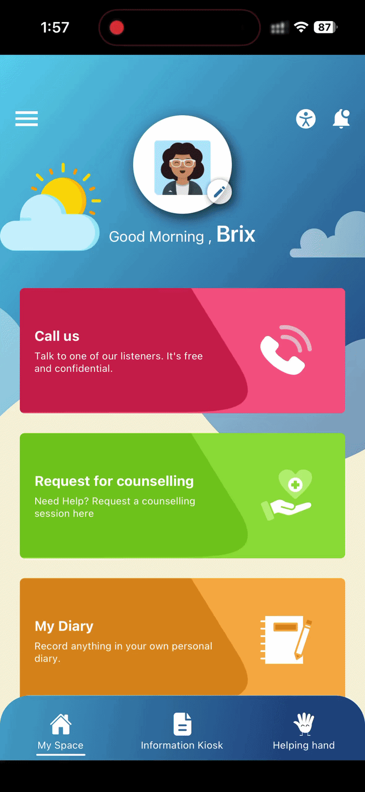

# Explore MyChild Helpline

## Overview

The **MyChild Helpline** section provides information about the app, its features, long-term goals, key partners, and available resources. You can browse articles and learn more about the services offered through the integrated website.

## Opening MyChild Helpline

1. Open the **MyChild Helpline** app.
2. Select **Information Kiosk** from the bottom navigation bar.
3. Select **MyChild Helpline**.

The app redirects you to the **MyChild Helpline** website.

## Reading About MyChild Helpline

When the website opens, an introduction to the **MyChild Helpline** app is displayed.

You can:

* Scroll through the page to read the information.
* Select **Read More** to continue reading.

The website includes information about:

* The background of the **MyChild Helpline** app
* App features
* Long-term goals
* Key partners

## Using the Menu

1. Select the **Menu** icon in the upper-right corner of the screen.

The menu provides access to sections such as:

* MyChild Helpline App
* Resources
* FAQs
* How to Use the App
* Feedback

Select a menu item to open the corresponding page or article.

## Reading Articles

Select any available article to open it.

The article is displayed on the screen, where you can scroll through the content and read it at your own pace.

## Returning to the Previous Screen

To return to the previous page:

1. Select the **Back** (`<`) icon in the upper-left corner of the screen.

The app returns you to the previous screen.
